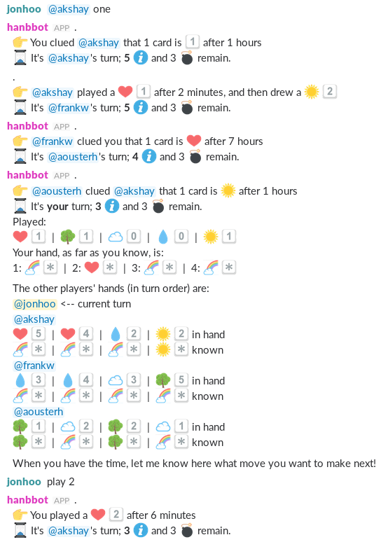

This is a Slack [bot](https://api.slack.com/bot-users) that allows users
to play the cooperative card game
[Hanabi](https://en.wikipedia.org/wiki/Hanabi_(card_game)) with one
another.



## Installation

 1. Create a new bot user [here](https://my.slack.com/services/new/bot).
 2. Note down the bot user's *API Token*.
 3. Invite the bot user to a channel called `#hanabi` (it may be
    private).
 4. Run the bot with
    
    ```console
    $ env "API_KEY=XXX" cargo run
    ```

    where `XXX` is the API token from step two.

At this point, the bot should make an announcement in `#hanabi` that
players can join.

## Usage

Players must first notify the Hanabi bot that they wish to play. They do
so by sending the bot `join` in a direct message. If you no longer wish
to participate in games, use `leave`.

The bot will try to construct games of five players. Once there are two
or more players, any player can instruct the bot to `start`, which
causes it to start a game with however many players are available.
A player can only be in one game at any given point in time.

During play, a player can play, clue, and discard:

 - To play, use `play <card>`, where `<card>` is the index of the card
   you wish to play from the left, starting at 1
 - To discard, use `discard <card>`, where `<card>` is the same as for
   `play`.
 - To clue, use `clue @player <specifier>` where `@player` is the user
   to clue, and `<specifier>` is either a color (e.g., `red`), or a
   number (e.g., `two`). The leading `clue` keyword is optional.

In addition, use `hands` to show all players' hands, and what each
player knows about their hand, `discards` to show the discard pile,
`deck` to show the number of cards left in the deck, and `ping` to
remind the current player that it's their turn. You can also terminate
the current game using `quit`.

When new cards are drawn, they appear on the right-hand side of your
hand.

## Known limitations

 - No spectator mode.
 - No support for playing with the rainbow suit.
 - No support for playing with character cards.
 - No long-term statistics tracking.

All of these are fixable. PRs are welcome.
